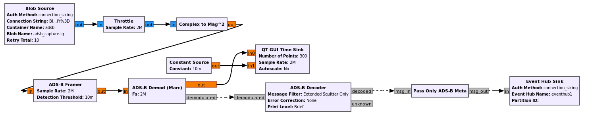

# Azure software radio Out of Tree Module

The gr-azure Out of Tree (OOT) Module allows users to easily leverage Azure cloud resources from within a GNU Radio flowgraph. You can use this OOT module with your existing GNU Radio development environment, or within a VM in the cloud.  Example use-cases involve storing and retrieving RF recordings from Blob (file) storage or creating complex cloud applications using Azure Event Hubs as a bridge between your flowgraph and [Azure services](https://azure.microsoft.com/en-us/services/).  We are excited to see what can be created by combining GNU Radio with the power and scalability of the cloud!

For information on our GNU Radio developer VM available in Azure, see [this guide](docs/devvm.md).  We also have a [set of tutorials](docs/tutorials.md) that use the developer VM and gr-azure.

<center></center>

## Table of Contents
- [Getting Started](#getting-started)
  - [Prerequisites](#prerequisites)
  - [Installing Azure software radio OOT](#installing-azure-software-radio-oot)
  - [Running the Unit Tests](#running-the-unit-tests)
  - [Resolutions to Common Problems During Installation and Tests](#resolutions-to-common-Problems-During-Installation-and-Tests)
- [Examples](#examples)
- [Blocks Documentation](#azure-software-radio-out-of-tree-module-blocks)
  - [Key Vault Block](#key-vault-block)
  - [Blob (incl. SigMF) Blocks](#blob-blocks)
  - [Event Hub Blocks](#event-hub-blocks)
  - [REST API Block](#rest-api-block)
- [Frequently Asked Questions](#frequently-asked-questions)
- [Support](#support)
- [Contributing](#contributing)
- [License](#license)
- [Trademarks](#trademarks)

## Getting Started

The following installation instructions will get you up and running with the Azure OOT Module on your local machine.

### Prerequisites
This project depends on the GNU Radio 3.9.x or 3.10.x runtime and development dependencies. See the [GNU Radio installation instructions](https://wiki.gnuradio.org/index.php/InstallingGR#From_Binaries) for steps on
installing GNU Radio from binaries (note that GNU Radio packaged with Ubuntu 20 is only 3.8). Some package managers do not automatically install all of the development dependencies,
so you may need to separately install and configure some of them. The Azure software radio OOT module requires the following:

- GNU Radio 3.9.x or 3.10.x
- Python 3.8 or greater
- cmake
- liborc-dev
- doxygen
- pytest
- pybind11
- Additional Python packages are listed in python/requirements.txt

See the installation steps below for how to install these dependencies.

**NOTE:** If using the Azure CLI, you will need version 2.17.1 or newer. This module is not compatible with
the Azure CLI availabile in the default apt repository on Ubuntu 20. If this older version of the Azure CLI is present
on your system, the installation of this OOT module may fail or the module may crash at runtime. Please install the
Azure CLI according to the recommendations found in [AZ CLI Installation in Linux](https://docs.microsoft.com/en-us/cli/azure/install-azure-cli-linux?pivots=apt).

### Installing Azure software radio OOT

The following steps show how to install this OOT module on a Debian-based OS with GNU Radio already installed.  They have been tested to work under Ubuntu 20.  If you see error messages after running any of the following steps, stop and check our [FAQ](./docs/FAQ.md) for how to
resolve the problem.

```bash
sudo apt-get install python3-pip cmake liborc-dev doxygen
sudo pip install pytest pybind11

git clone https://github.com/microsoft/gr-azure.git
cd gr-azure

sudo pip install -r python/requirements.txt

mkdir build
cd build
cmake ..
make -j4
sudo make install
sudo ldconfig
```

(If you run into a non-existent path error after `cmake ..`, try recreating your build directory and use `cmake -DCMAKE_FIND_ROOT_PATH=/usr ..` instead)

At this point the OOT module should have been installed, and you should see additional blocks within GNU Radio Companion.

### Running the Unit Tests
If you would like to run the QA tests, there are two methods:
 1. From within the build directory, run:
    ```
    make test
    ```

    You can review detailed test output (including any failures) in Testing/Temporary/LastTest.log.

 2. From within the python directory, run:
    ```
    python -m pytest qa_*
    ```

    Pytest will show detailed test results directly in the output of this command.

### Resolutions to Common Problems During Installation and Tests
For a list common problems and resolutions, please check our [FAQ](./docs/FAQ.md) to see if your issue has been addressed.

## Examples
The [examples](./examples) folder has a collection of flowgraphs and supporting files that illustrate common ways of
using the blocks provided in this module. See the [README in the examples folder](./examples/README.md) to get started.

## Azure software radio Out of Tree Module Blocks

### Key Vault Block
The Key Vault block allows users to pull down keys and secrets from an [Azure Key Vault](https://docs.microsoft.com/en-us/azure/key-vault/general/overview) in GNU Radio.
It is expected that the user will setup and store secrets in an Azure Key Vault prior to pulling down keys using this block. To create a Key Vault, see [Create Key Vault](https://docs.microsoft.com/en-us/azure/key-vault/secrets/quick-create-cli).

For a brief tutorial on using this block, see the [Key Vault Example](./examples/README.md#key-vault-example).


### Blob Blocks
The two Blob blocks (source and sink) provide an interface to read and write samples to [Azure Blob storage](https://docs.microsoft.com/en-us/azure/storage/blobs/storage-blobs-introduction) in GNU Radio.
Note that the SigMF Blob Source/Sink are simply wrappers around the regular Blob Source/Sink with SigMF mode set to True.
It is expected that the user will setup a storage account and a container prior to accessing Blob storage with the Blob source and sink blocks. To create a storage account, see [Create Storage Account](https://docs.microsoft.com/en-us/azure/storage/common/storage-account-create?tabs=azure-portal).

 * __Blob Source Block & SigMF Blob Source Block__\
	The Blob source block reads samples from Azure Blob storage. This block currently supports block blobs and the following outputs: complex, float, int, short and byte (Page blobs and append blobs are not supported at this time).

 * __Blob Sink Block & SigMF Blob Sink Block__\
	The Blob sink block writes samples to Azure Blob storage. This block currently supports block blobs and the following inputs:  complex, float, int, short and byte (Page blobs and append blobs are not supported at this time).

There are several ways to authenticate to the Azure blob backend, these blocks support authentication using a connection string, a URL with an embedded SAS token, or use credentials supported by the DefaultAzureCredential class.

To determine the max speed at which samples can be downloaded or uploaded to/from Blob storage, for different Azure regions, run https://www.azurespeed.com/Azure/Download or https://www.azurespeed.com/Azure/Upload on the VM or machine running GNU Radio.

For a brief tutorial on using these blocks, see the [Blob Examples](./examples/README.md#Blob-Source-and-Sink-Examples).

### Event Hub Blocks
The Event Hub blocks (source and sink) provide an interface to send and receive events to [Azure Event Hubs](https://docs.microsoft.com/en-us/azure/event-hubs/event-hubs-about) using the message passing interface in GNU Radio.
It is expected that the user will create an Event Hubs namespace, Event Hub entity and consumer group prior to using the Event Hub source and sink blocks. To create an Event Hub, see [Create an Event Hub](https://docs.microsoft.com/en-us/azure/event-hubs/event-hubs-create).

 * __EventHub Source Block__\
	The EventHub source block receives a JSON formatted event message from Azure Event Hub and converts it to GNU Radio PMT format.

 * __EventHub Sink Block__\
	The EventHub sink block converts a PMT message to JSON and sends it to Azure Event Hub.

These blocks support multiple ways to authenticate to the Azure Event Hub backend, such as using a connection string, a SAS token, or use credentials supported by the DefaultAzureCredential class.

For a brief tutorial on using these blocks, see the [Event Hub Examples](./examples/README.md#Event-Hub-Examples).

### REST API Block
The REST API block allows users to get status and configure a running top block in GNU Radio. It starts a server in the configured port and restricts which settings and variables in a flowgraph are readable, writable or callable.

To get status from a flowgraph, a user can hit the status endpoint as follow

``curl -X GET http://<IP>:<port>/status``

To configure or write the exposed variables, the following command

``curl -X PUT http://<IP>:<port>/config -H 'Content-Type: application/json' -d '{"<variable>":<value>}'``

To execute a callback or function within a top block, use the following route

``curl -X PUT http://<IP>:<port>/call -H 'Content-Type: application/json' -d '{"<function name>":<parameter>}'``

For a brief tutorial on using this block, see the [REST API Example](./examples/README.md#rest-api-example).


## Frequently Asked Questions
For a list of common questions, including problems and resolutions, please check our [FAQ](./docs/FAQ.md)

## Support

This project uses [GitHub Issues](https://github.com/microsoft/gr-azure/issues) to track bugs and feature requests. Please refer to our [Support Guide](SUPPORT.md#how-to-file-issues-and-get-help) for more details.

Before filing a new issue, please check our [FAQ](./docs/FAQ.md) for potential solutions to common problems.

Starting with [GNU Radio](https://github.com/gnuradio/gnuradio) maint-3.9, this project will support the same set of [maintenance branches](https://github.com/gnuradio/gnuradio/branches) tracked by GNU Radio.

## Contributing

[Contributing Guide](./CONTRIBUTING.md)

## License

This project is licensed under the GNU General Public License v3.0 or later - see the [LICENSE](LICENSE.txt) file for details

## Trademarks

This project may contain trademarks or logos for projects, products, or services. Authorized use of Microsoft trademarks or logos is subject to and must follow Microsoft's Trademark & Brand Guidelines. Use of Microsoft trademarks or logos in modified versions of this project must not cause confusion or imply Microsoft sponsorship. Any use of third-party trademarks or logos are subject to those third-party's policies.