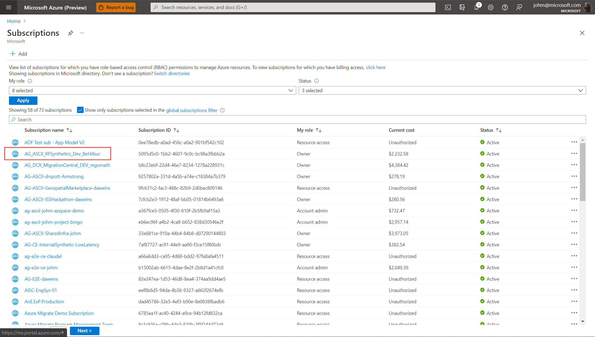
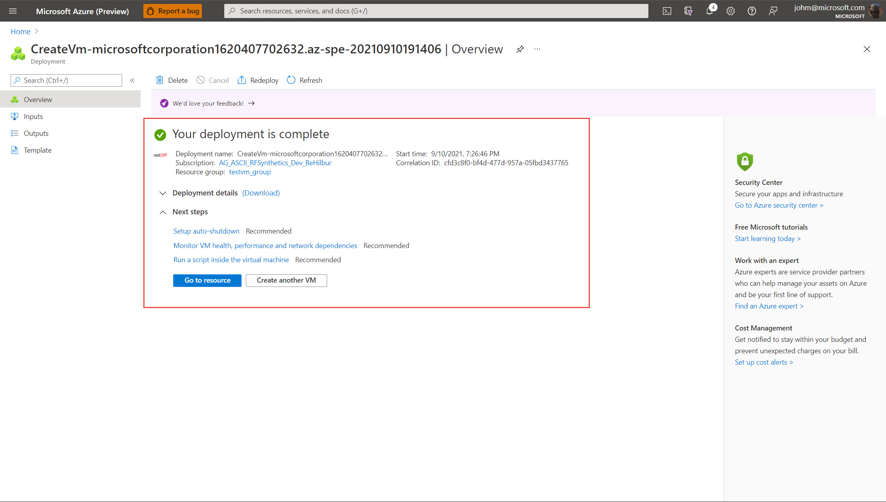

# Welcome To Azure software radio development VM 

The Azure software radio development VM is the start of major investments by the Azure Spectrum Team to facilitate software defined radio development on Azure. This will accelerate development of SDR applications and harness the power of Azure to expand potential oppurtunities in this industry.

To launch our first set of offerings we have built a development vm on Ubuntu 20.04 which is ready to go with the most common tools for developing SDR. These include

1. GNU Radio 
2. Fosphor

We have also included Azure Native Tools including
1. Azure CLI
2. Azure Storage Copy (AzCopy) 

Once you deploy the virtual machine simply RDP/VNC to the machine and get developing!

The VM is deployed into a self-contained resource group, virtual network and public ip address. 
You should take additional steps to secure the public ip address to only allow connections from trusted IP's.

If you have any feedback simply log an issue on this github repo or get in touch with the team via email at azuresoftwareradio@microsoft.com

## Signing up for the Private Preview of the Azure software radio development VM

Currently the Azure software radio development VM is in Private Preview and it requires for our team to authorize you to deploy the service. 

To sign up for the Development VM click [Here](https://forms.office.com/r/sbZqBUVUE0) 

Fill in the required details and our team will ensure you get authorized within 24 hours for the service.

Follow the deployment instructions to validate access to the development vm and begin deployment

## Validating Access to the Development VM

1. Open your browser and navigate to [AzurePortal](https://portal.azure.com) and sign-in 
2. In the search bar type "MarketPlace" and Click MarketPlace 
   
   

3. Click Close and Click Private Products
   
   

4. If access has been approved the Marketplace offer will be listed as shown, you may have to use the search bar to find Azure software radio development VM if you have a large amount of private product offerings associated to your subscription. 
   **Do not select the offer marked preview**
   
   

   **if you dont see the offering listed and it is more than 48 hours since you filled in the form contact the Azure software radio development VM team via email azuresoftwareradio@microsoft.com**

## Validate Qouta Requirements

1. From the Azure Portal Click Subscriptions

   

2. Locate and Click your subscription

   

3. Click Usage & Qoutas

   

4. Type NV in the search bar and verify as shown that you have sufficient qouta (at least 12 free cores) for the region you want to deploy into.

   

5. if you do not have enough qouta, click the pencil (edit) icon and request more cores and ensure it is successful before attempting to deploy the development vm.

## Deployment of the Azure software radio development VM

1. Navigate back to the Private Product Offering outlined in the *Validating Access to the Development VM* section
2. Click Create to begin the VM creation
   
   

3. On the Create VM Page 1, select the subscription which has been authorized for development vm and allow for a dynamic resource group to be created or select an existing one. Enter a Name for the virtual machine, select the same region to which you have applied and have available qouta, leave the remaining settings as is except for use Password or SSH Key. Select the appropraite one for your deployment and Click Next: Disks
   
   

4. Click Next: Networking and Review Settings nothing needs to be changed
5. Click Next: Management and Review Settings 
6. Click the checkbox for System Managed Identity and Click Next: Advanced
   
   

    **The System Managed Identity can be assigned permissions to Azure Resources Post Deployment to allow the Azure Client and AzCopy to login to directly to Azure and access resources it has been authorized to**
    
7. Click Review+Create and then Click Create
8. Confirm the deployment is successful as shown and click Go To Resource
   
   

## Connect to the Development VM 

1. On the VM resource page record the Public IP Address 
   
   

2. Start your favourite RDP client enter the IP Address and logon with the credentials set during deployment
